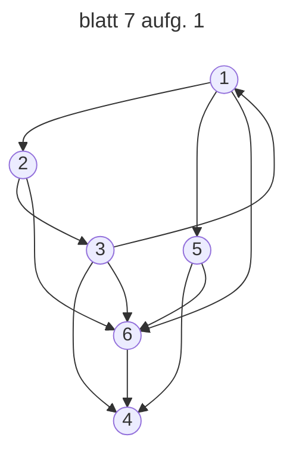

V(1) = {3}, N(1) = {2, 5, 6} V(2) = {1}, N(2) = {3, 6} V(3) = {2}, N(3) = {1, 4, 6} V(4) = {3, 5, 6}, N(4) = ∅
V(5) = {1}, N(5) = {4, 6} V(6) = {1, 2, 3, 5}, N(6) = {4}

j<sub>0</sub>=1 --> j<sub>t</sub>=4:

```ṁermaid
1-->5-->6-->4
```

Knoten 4: N(4)=∅

