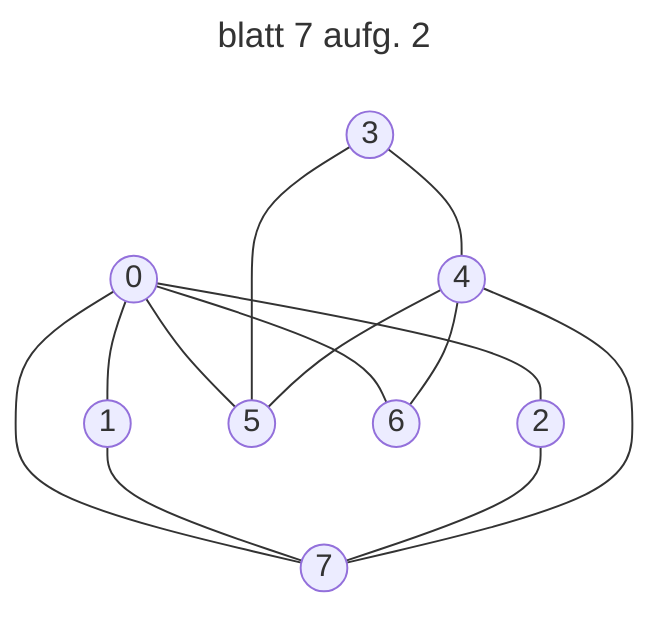

DFS: 0→1→7→6→4→5→3→2

BFS: 0→1→2→5→6→7→4→3

<h3>7.3 Adjazenzmatrix</h3>

<h4>BFS</h4>

**Nachfolger von a:**  
b, c, d, f, i, k

**Besuchte Knoten:**  
a, b, c, d, f,i, k

**Nachfolger von b:**  
e, g, j

**Besuchte Knoten:**  
a, b, c, d, e, f, g, i, j, k,

**Nachfolger von c:**  
h, l

**Besuchte Knoten:**  
a, b, c, d, e, f, g, h, i, j, k, l,

<h4>DFS</h4>

ab bc

besucht:abc

cd besucht:abcd

dg besucht:abcdg

gh besucht:abcdgh

hj besucht:abcdghj

jk besucht:abcdghjk

kl besucht:abcdghjkl

zurück: ef besucht:abcdefghjkl

zurück: i

schluss:abcdefghijkl
